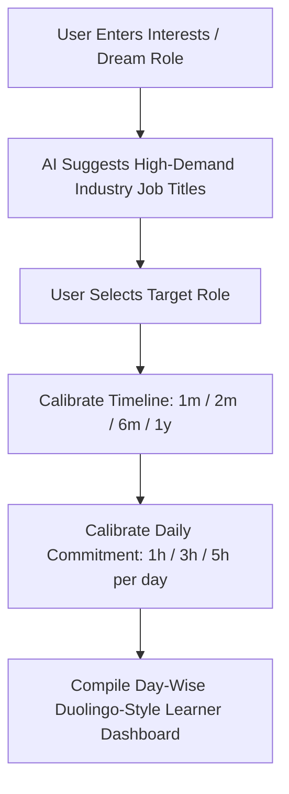

# 🚀 HIRESTACK — MASTER PRODUCT SPECIFICATION & ARCHITECTURAL BLUEPRINT

**Version:** 3.0.0  
**Status:** Approved & Finalized for Execution  
**Platforms:** Electron Desktop Shell (Windows / macOS / Linux) + Web Showcase  
**Design System:** Monochrome Swiss / Linear Dark Aesthetic (`#09090B`, `#121215`, `#27272A`, `#FAFAFA`)

---

## 1. Executive Summary & Core Philosophy

**Hirestack** is an all-in-one desktop career acceleration operating system that bridges the gap between **skill mastery** and **automated job acquisition**. 

It eliminates the traditional fragmented workflow where candidates study on disconnected platforms, manually fill out hundreds of repetitive job applications, and blind-guess HR emails.

```
┌────────────────────────────────────────────────────────────────────────────────────────┐
│                                       HIRESTACK                                        │
├───────────────────────────────────────────┬────────────────────────────────────────────┤
│           🎓 PILLAR 1: LEARNER HUB         │           ⚡ PILLAR 2: SEEKER HUB          │
│        (0-to-Job-Ready Milestone Tree)    │     (High-Throughput Job Acquisition)      │
├───────────────────────────────────────────┼────────────────────────────────────────────┤
│ • Dynamic AI Goal & Role Calibration      │ • 1,000+ Source Stream (Anti-Ghost Filter) │
│ • Duolingo-Style Node Progression Tree    │ • Semi-Auto Mode (3-5 Tab RAM-Safe Review) │
│ • 3-Step Loop: Learn ➔ Practice ➔ Apply   │ • 100% Autonomous Mode (Groq LLaMA 3.1 8B) │
│ • Day-Wise Schedule (1h / 3h / 5h Daily)  │ • 4-Stage 0%-Bounce HR Email Verifier      │
│ • GitHub-Style Contribution Streak Heatmap│ • Humanized Outreach Drip (15-25/day Cap)  │
│ • In-App AI Mascot / Study Companion      │ • 1-Click Competency Transfer to Profile   │
└───────────────────────────────────────────┴────────────────────────────────────────────┘
```

---

## 2. Pricing, Tiers & Monetization Architecture

All new accounts start with an unrestricted **3-Day Free Trial** on signup via **Google OAuth**, bound directly to their hardware.

| Tier | Price (INR) | Positioning | Inclusions & Quotas |
| :--- | :--- | :--- | :--- |
| **Free Tier** | **₹0** | Trial / Casual Learner | • 3-Day unrestricted free trial on signup<br>• Access to standard roadmap milestones<br>• Preview of today's Top 10 curated job stream<br>• Local progress storage |
| **Learner Pro** | **₹79 / mo** | Students & Self-Learners | • **Full Duolingo-style interactive node trees**<br>• Day-by-day scheduler customized to timeline & hours<br>• Curated resource vault (Verified YT playlists, docs, books)<br>• Interactive coding drills, quizzes, & project challenges<br>• GitHub-style activity streak heatmap & AI Companion |
| **Seeker Pro** | **₹149 / mo** | Active Job Hunters | • Everything in Free Tier<br>• **Full 1,000+ ATS job radar** with anti-ghost job filtering<br>• **Semi-Autonomous Auto-Apply** (up to 50 applications/week)<br>• 25 Verified HR / Recruiter leads per week<br>• Cloud sync for bookmarks & application tracker |
| **Seeker Max** | **₹299 / mo** | Full Autopilot & Placement | • **All-in-One: Full Learner Pro + Seeker Pro**<br>• **100% Autonomous Auto-Apply Engine** (Unlimited)<br>• Automated 0%-bounce HR cold email drip campaigns<br>• Priority ATS sync (every 15 minutes)<br>• Single-Laptop Hardware License Lock |

### Payment & Licensing Rules:
- **Payment Gateway**: Razorpay (supporting UPI, Cards, Netbanking, Cred).
- **Trial Anti-Abuse**: Free 3-day trial is bound to the computer's **Hardware Fingerprint (UUID + CPU ID)**. Creating multiple Google accounts on the same laptop will not restart the trial.
- **Refund Policy**: Strict no-refund policy explicitly communicated prior to checkout.

---

## 3. Intelligent Onboarding & Dynamic Profiling Engine



1. **Role Matching**:
   - User enters raw keywords or background (e.g., *"Frontend React with TypeScript"* or *"AI Automation Specialist"*).
   - AI matches and suggests verified, high-demand industry job titles.
2. **Commitment Calibration**:
   - **Target Horizon**: `1 Month (Bootcamp Speed)`, `2-3 Months (Fast Track)`, `6 Months`, or `1 Year (Deep Foundations)`.
   - **Daily Bandwidth**: `1 hr/day`, `2-3 hrs/day`, or `5+ hrs/day`.
3. **Curriculum Compilation**:
   - Calculates the exact total hours and outputs a **day-by-day modular agenda** mapped onto the interactive skill tree.

---

## 4. Pillar 1: Hirestack Learner Hub (Deep Dive)

### A. Duolingo-Style Node Progression Tree (Not a Drawing)
- **Serpentine Path Architecture**: Progressive interactive nodes that visually unlock as prerequisites are met.
- **Node States**:
  - `Locked`: Greyed out with lock badge until prerequisite is completed.
  - `Active / In Progress`: Highlighted with pulse ring, showing current day's sub-tasks.
  - `Completed`: Clean monochrome border with checkmark badge and unlocked skill tags.
- **Hierarchical Checkpoints**:
  - Example (Frontend Track):
    * **Node 01: Semantic HTML & DOM** ➔ Tags, Forms, Web Accessibility (WCAG), SEO meta.
    * **Node 02: Responsive CSS & Tailwind** ➔ Box model, Flexbox, CSS Grid, Responsive media queries, Utility tokens.
    * **Node 03: Modern JavaScript & ES6+** ➔ Event loop, Promises, Async/Await, Array methods, DOM APIs.
    * **Node 04: React 18 Architecture** ➔ Custom hooks, Component state, Virtual DOM, TanStack Query.
    * **Node 05: Capstone Application** ➔ Full-stack deployment with Auth & Database.

### B. The 3-Step Mastery Loop (Per Node)
Each node contains a 3-step action panel:

```
┌────────────────────────────────┐
│            1. LEARN            │
│  Curated YouTube Playlists,    │
│  Official Docs, Book Chapters  │
└───────────────┬────────────────┘
                │
                ▼
┌────────────────────────────────┐
│           2. PRACTICE          │
│  Interactive Coding Questions, │
│  Syntax Drills, Logic Quizzes  │
└───────────────┬────────────────┘
                │
                ▼
┌────────────────────────────────┐
│            3. APPLY            │
│  Production-Ready Projects     │
│  w/ Step-by-Step Architecture  │
└────────────────────────────────┘
```

1. **Learn**: Zero-fluff, verified permanent learning assets (MDN, official frameworks, top YouTube playlists, cheatsheets, textbook references).
2. **Practice**: In-app coding exercises, multiple-choice quizzes, algorithm/syntax drills with instant automated validation.
3. **Apply**: Real-world portfolio project blueprints with step-by-step architecture guides, GitHub starter repositories, and deployment checklists.

### C. Gamification & Retention Engine
- **GitHub-Style Contribution Heatmap**: Visual 52-week activity grid rendering green/monochrome intensity squares based on daily completed sub-tasks.
- **Streak Flame Counter**: Daily habit reinforcement tracker with streak freeze protection.
- **Duolingo-Style AI Companion (Tutor Mascot)**:
  - Persistent assistant in the lower corner of the Learner dashboard.
  - Explains syntax errors, suggests interview strategies, and provides interactive quizzes.
- **1-Click Competency Transfer**:
  - Clicking *"Transfer Skills to Seeker Profile"* automatically inserts all completed node skills directly into `profile.techStack` and updates target titles for the auto-apply engine.

---

## 5. Pillar 2: Hirestack Seeker Hub (Deep Dive)

### A. High-Signal Job Radar (1,000+ Sources) & Advanced Filtering
- **Direct ATS Ingestion**: Real-time endpoints from Greenhouse, Lever, Ashby, Workday, Internshala, and verified company career portals.
- **Anti-Ghost Job Filter**: Cryptographic SHA-256 deduplication (`SHA256(company + title + apply_url)`) and 14-day inactivity purging to guarantee 0% stale listings.
- **Comprehensive Multi-Dimensional Filter Bar**:
  - **Source Filter**: `All Sources`, `Internshala`, `Direct ATS (Greenhouse / Lever / Ashby)`, `Remote Tech Boards`.
  - **Sorting / Recency**: `Most Recent (Default)`, `Highest Match %`, `Stipend / Salary High to Low`.
  - **Workplace & Employment Type**: `Remote`, `Hybrid`, `Onsite`, `Internship / Fresher`, `Full-time`, `Contract`.
  - **Compensation & Stipend Range**: `Any`, `₹15k+/mo (Internship)`, `₹30k+/mo`, `₹6 LPA+`, `₹12 LPA+`, `₹25 LPA+`.
- **Strict User Personalization (Zero-Noise Guarantee)**:
  - The job feed automatically applies candidate profile filters (`desiredTitle`, `techStack`, `experienceLevel`). A React/Frontend candidate sees curated Frontend opportunities rather than being overwhelmed by unrelated DevOps or Marketing postings.

### B. Dual Auto-Apply Modes
1. **Semi-Autonomous Mode (RAM-Safe Review)**:
   - Playwright Stealth launches a controlled queue of **3–5 parallel Chromium tabs** (preventing memory crashes on student laptops).
   - Pre-fills all candidate info and resume uploads, pausing for 1-click candidate review before submission.
2. **100% Autonomous Mode**:
   - Executes complete end-to-end background form filling.
   - Dynamic Groq LLaMA 3.1 8B engine resolves custom open-ended questions using candidate context.
   - **Local Answer Cache**: Answers to recurring questions (e.g. *"Tell me about yourself"*, *"Years of experience"*) are cached locally in SQLite, slashing LLM API latency and operating costs.
3. **CAPTCHA / OTP Safeguard**:
   - Detects Cloudflare Turnstile, Arkose Labs, or email OTP barriers.
   - Brings the Chromium window to foreground with an audio/visual nudge for manual user completion, then resumes autopilot.

### C. 0%-Bounce HR Cold Outreach (Hyper-Personalized & Global Web Scraping)
- **Dual-Engine Lead Discovery (Global Scale)**:
  1. **Real-Time Global Web & Search Dorking**:
     - Automatically crawls and parses public web search indexes, company `/about` & `/team` pages, GitHub organization maintainers, and press portals using targeted dorks:
       `"{Company}" ("recruiter" OR "talent acquisition" OR "engineering manager" OR "head of product")`
     - Extracts candidate email strings using RFC 5322 regex parsing directly from indexed web documents.
  2. **Corporate Domain Pattern Synthesis**:
     - Fallback pattern engine (`first.last@company.com`, `first@company.com`, `firstlast@company.com`) mapped across global MNCs, scaleups, and venture-backed startups across US, EU, India, and APAC.
- **Role-Gated Lead Matching**:
  - A user only sees HR emails and decision-maker contacts (Engineering Managers, Tech Leads, Talent Recruiters) that **directly match their target role and active job applications**.
  - No random sales or generic emails — every contact is relevant to the candidate's exact domain.
- **4-Stage Email Verification Pipeline (Mandatory for all Web-Scraped Leads)**:
  - *Stage 1*: RFC 5322 Syntax validation.
  - *Stage 2*: Role & Disposable account filter (`info@`, `support@`, `sales@`, `jobs@`).
  - *Stage 3*: Real-time DNS MX record verification (confirms Google Workspace, Microsoft 365, or corporate mail exchange).
  - *Stage 4*: Direct SMTP socket ping (`HELO` ➔ `MAIL FROM` ➔ `RCPT TO`) to verify mailbox existence on port 25 with ISP fallback.
- **Humanized Drip Engine**:
  - Strict daily cap of **15–25 emails/day** per user.
  - Randomized drip delay of **60s–180s** between messages.
  - Dispatches via the user's default browser Gmail compose session or local authenticated SMTP, protecting sender reputation from spam bans.

---

## 6. What Could Go Wrong — Complete Risk Matrix & Engineered Fixes

### ⚡ 1. DOM & Browser Automation Micro-Edge Cases
* **Laptop Freezes/Crashes**: Opening 20 parallel browser tabs will kill a student’s 8GB RAM laptop.  
  ↳ *Engineered Fix: Cap strictly to 3–5 parallel tabs max using an active FIFO background queue.*
* **CAPTCHAs & OTP Blockers**: Cloudflare Turnstile, Arkose Labs, or email verification codes silently freeze the automation bot.  
  ↳ *Engineered Fix: Pop up a visible Chromium window + audio/visual chime for the user to solve it, then auto-resume.*
* **AI Hallucinations in Forms**: The LLM enters text into a numeric field or selects the wrong dropdown option.  
  ↳ *Engineered Fix: Enforce strict JSON schema validation and field-alias mapping before filling any DOM element.*
* **Shadow DOM & Web Components (Workday / Salesforce)**: Form inputs encapsulated inside `#shadow-root (open/closed)` causing standard querySelectors to return null.  
  ↳ *Engineered Fix: Use Playwright's piercing CSS selector engine (`css=div >> css=input[type="email"]`) to penetrate Shadow DOM trees.*
* **Split Phone & Country Dial Code Dropdowns**: ATS forms splitting phone inputs into custom dial code popovers (`+91` / `+1`) and 10-digit number inputs.  
  ↳ *Engineered Fix: Normalize phone numbers with `libphonenumber-js`. Strip country prefix for text inputs and select the dial code dropdown separately.*
* **Address / Location Autocomplete Dropdowns**: Typing location requires clicking Google Places / Mapbox dropdown predictions to register.  
  ↳ *Engineered Fix: After filling location text, wait 300ms, dispatch `ArrowDown` + `Enter`, or click the first `.pac-item` child.*
* **EEOC Demographics & Voluntary Survey Fields**: Mandatory demographic questions (*Gender, Race, Veteran, Disability*) blocking form submission if empty.  
  ↳ *Engineered Fix: Automatically select safe compliant defaults (*"Decline to self-identify" / "I do not wish to answer"*).*
* **Custom Dropdowns & Popovers (React-Select / Radix UI)**: Portals using custom `<div>` popovers rather than standard `<select>` tags.  
  ↳ *Engineered Fix: Simulate native clicks on the dropdown trigger, wait for option popovers to render, and click the matching text node.*
* **Hidden File Dropzones (`display: none`) & 2MB Limits**: Portals hiding `<input type="file">` behind drag-and-drop listeners or rejecting large files.  
  ↳ *Engineered Fix: Inject files via Playwright's `setInputFiles()` + client-side PDF size validation and 1-click compression via `pdf-lib`.*
* **Multi-Step Application Wizards**: Multi-page forms (*Personal ➔ Experience ➔ EEOC ➔ Review*) stalling on dynamic steps.  
  ↳ *Engineered Fix: Step-by-step navigation loop that detects "Next" buttons and verifies DOM readiness on each page transition.*

### 📬 2. Cold Emailing & Web Scraping Risks
* **Gmail Account Suspension**: Blasting 50+ emails too fast flags the user’s personal Google account for spam.  
  ↳ *Engineered Fix: Cap strictly at 15–25 emails/day per user with 60s–180s randomized drip delays via logged-in browser session.*
* **Burned Domain / High Bounce Rate**: Guessing or scraping broken emails destroys sender reputation.  
  ↳ *Engineered Fix: Run every email through the 4-stage verifier (DNS MX + live socket SMTP ping) before sending.*
* **"Catch-All" Corporate Server Traps**: Enterprise mail servers (Exchange / Proofpoint) returning fake `250 OK` for all addresses.  
  ↳ *Engineered Fix: Probe a known non-existent mailbox (`xyzrandom123@domain.com`). If it returns `250 OK`, mark domain as Catch-All/Risky.*
* **Scraping Garbage / Generic Emails**: Web scraping pulling `support@`, `legal@`, or dummy addresses instead of real hiring managers.  
  ↳ *Engineered Fix: Filter out role prefixes (`support@`, `info@`, `sales@`) and match only relevant titles (Tech Lead, EM, Recruiter).*
* **Port 25 Blocked by Indian ISPs (Airtel, Jio, ACT)**: Residential ISPs blocking raw TCP port 25 socket pings.  
  ↳ *Engineered Fix: 3-second timeout on socket pings with graceful fallback to DNS MX validation.*
* **Gmail 500-Email Daily Send Cap**: Personal Gmail accounts hitting the 500 rolling emails/day limit.  
  ↳ *Engineered Fix: Local SQLite tracks rolling 24-hour sent counts with visual progress gauges in the UI.*

### 🛰️ 3. Job Radar & Backend Scaling Bottlenecks
* **URL Tracking Parameter Hash Collisions**: Tracking query params (`?utm_source=...`) causing duplicate job cards.  
  ↳ *Engineered Fix: Sanitize and strip all tracking query params (`utm_*`, `gh_jid`, `ref`) before computing the SHA-256 hash.*
* **Expired / Ghost Jobs**: Job boards filling up with stale, expired, or reposted listings.  
  ↳ *Engineered Fix: Deduplicate with cryptographic SHA-256 hashes and auto-archive jobs older than 14 days.*
* **Scraper IP Blacklisting & API Rate Limits**: Aggressive DOM scraping triggering rate limits and blocking server IPs.  
  ↳ *Engineered Fix: Scrape direct public ATS JSON APIs (Greenhouse, Lever, Ashby) with `If-Modified-Since` headers to eliminate bot blocking.*
* **GitHub Actions 2,000-Minute Quota Exhaustion**: Running 15-minute crons burning free private repo minutes in 20 days.  
  ↳ *Engineered Fix: Schedule scraper cron every 2 hours (12 runs/day = ~720 mins/month, 100% within free limits).*

### 🎓 4. Learner Hub & Code Runner Bottlenecks
* **The `while(true)` Infinite Loop Freeze**: A user accidentally writing an infinite loop in the practice editor and crashing the app.  
  ↳ *Engineered Fix: Execute user code inside an isolated **Web Worker with a strict 2-second timeout** that aborts runaway scripts.*
* **Memory Leaks in Sandboxed Code Runner**: Sequential practice test runs accumulating uncollected memory in Electron.  
  ↳ *Engineered Fix: Destroy and recreate the Web Worker instance every 10 practice test runs to release memory.*
* **Multi-Device Offline Sync Conflicts**: Completing milestones offline on Laptop A while Laptop B has older cloud state.  
  ↳ *Engineered Fix: **Union-Set Merging** ($\text{Merged} = \text{Cloud} \cup \text{Local}$) ensuring completed milestones are never lost.*
* **AI API Outages / 429 Rate Limits**: Groq or Gemini experiencing temporary outages or rate-limit spikes.  
  ↳ *Engineered Fix: Exponential backoff retries + local fallback to pre-baked hint & interview answer dictionaries.*
* **Dead Links & Outdated Videos**: AI inventing 404 YouTube links or pointing to obsolete 2018 tutorials.  
  ↳ *Engineered Fix: Store a verified static vault of permanent resources; use AI only to sequence them into daily tasks.*
* **Day-3 Motivation Drop**: Users giving up quickly if daily roadmaps feel too long or exhausting.  
  ↳ *Engineered Fix: Keep daily tasks strictly bite-sized (1 concept + 1 mini coding drill) + streak heatmap rewards.*

### 💰 5. Economics, Payments & Business Bottlenecks
* **Token Costs Eating Profits**: Groq/LLM calls for auto-apply and AI tutor eating up the ₹79 subscription fee.  
  ↳ *Engineered Fix: Cache recurring answers locally in SQLite for ₹0 repeat queries.*
* **RBI Recurring Auto-Debit (e-Mandate) Failure**: Recurring monthly card subscriptions failing for ~40% of Indian debit cards.  
  ↳ *Engineered Fix: Offer **1-Month & 3-Month Prepaid Passes** via UPI (GPay, PhonePe, Paytm) alongside auto-recurring subscriptions.*
* **Razorpay Webhook Drops on Poor Connectivity**: Mobile UPI payments completing while desktop Wi-Fi is temporarily disconnected.  
  ↳ *Engineered Fix: Supabase processes server-to-server Razorpay webhooks; desktop polls Supabase heartbeat on reconnection.*
* **Chargeback Penalty Fees**: Unjustified bank chargebacks incurring gateway dispute fees.  
  ↳ *Engineered Fix: Clear pre-checkout TOS checkbox for digital products + 1-click self-serve subscription cancellation in Settings.*
* **Infinite Free-Trial Recycling**: Users creating throwaway Google accounts to keep getting 3 free days.  
  ↳ *Engineered Fix: Lock the 3-day trial to the laptop's hardware fingerprint (Motherboard UUID + CPU ID).*

### 🖥️ 6. Desktop OS & Packaging Safety
* **Google OAuth Blocked in Electron (`403 disallowed_useragent`)**: Google actively blocking OAuth inside embedded webviews.  
  ↳ *Engineered Fix: Open the real system browser with a local loopback server (`localhost:42813`) to receive OAuth tokens securely.*
* **Windows File Paths with Spaces**: User accounts like `C:\Users\Sajal Sharma (Personal)\...` breaking process spawning.  
  ↳ *Engineered Fix: Sanitize and quote all file paths (`"${filePath}"`) across all IPC bridges.*
* **Windows SmartScreen Blue Warning**: Unsigned `.exe` triggering scary *"Windows protected your PC"* warnings.  
  ↳ *Engineered Fix: Obtain an Authenticode code-signing certificate and run under standard user permissions (`asInvoker` without UAC prompt).*
* **SQLite Corruption on Sudden Laptop Lid Close**: Laptop power loss or sleep during active SQLite write transactions.  
  ↳ *Engineered Fix: Enable SQLite **WAL (Write-Ahead Logging)** mode and auto-backup a `.bak` snapshot on every startup.*
* **Electron 24/7 Background Memory Bloat**: Leaving the desktop app minimized in the tray for days ballooning RAM.  
  ↳ *Engineered Fix: Enable background throttling (`disable-renderer-backgrounding: false`), suspending views when minimized (<45MB RAM).*

---

## 7. UI/UX Design System ($10M SaaS Aesthetic)

- **Color System**:
  - `Background Base`: `#09090B` (Pitch Dark)
  - `Surface Panels`: `#121215` (Elevated Charcoal)
  - `Border Accents`: `#27272A` (Subtle Slate)
  - `Typography`: `#FAFAFA` (Headings) / `#A1A1AA` (Muted Subtext)
  - `Success / Active`: `#10B981` (Emerald) / `#FAFAFA` (Monochrome Glow)
- **Component Design**:
  - **Sidebar**: Ultra-clean icon + label collapsible rail with active track badge.
  - **Command Palette**: `Ctrl + K` / `Cmd + K` for instant search across roadmaps, jobs, and tools.
  - **Micro-Animations**: Anime.js spring curves for tab switches and node completions.
  - **Typography**: Inter / Geist sans-serif paired with JetBrains Mono for metrics and logs.

---

## 8. Database Architecture & Schema Design

### A. Local SQLite Storage (`apps/desktop/src/main/db.ts`)
- `master_profile`: Candidate contact, education, experience, target roles, tech stack, custom answers dictionary.
- `learner_progress`: Roadmap IDs, completed node list, streak count, last active date.
- `cached_form_answers`: Hash map of recurring ATS question embeddings and verified candidate responses.
- `applied_jobs`: Job ID, title, company, apply URL, status (`submitted`, `review`, `failed`), timestamp.
- `hr_leads`: Verified contacts, company, email, status (`valid`, `risky`, `sent`), outreach timestamp.

### B. Supabase Cloud Database (`packages/supabase`)
- `users_profile`: User UUID, email, subscription tier (`free`, `learner_pro`, `seeker_pro`, `seeker_max`), license key, hardware fingerprint, trial expiration.
- `user_sessions`: Active single-device hardware session tokens and IP heartbeat tracker.
- `user_learner_progress`: Synced roadmap progression and streak records.
- `jobs`: Aggregated ATS job feed deduplicated via SHA-256 hashes.
- `hr_contacts`: Verified recruiter email directory.

---

## 9. Phased Execution Roadmap

```
┌────────────────────────────────────────────────────────────────────────┐
│                        IMPLEMENTATION PHASES                           │
├────────────┬───────────────────────────────────────────────────────────┤
│  PHASE 1   │ • Interactive Duolingo-style node tree in LearnerView     │
│ (Learner)  │ • Onboarding goal & hours input questionnaire             │
│            │ • GitHub-style streak heatmap & AI Companion mascot       │
├────────────┼───────────────────────────────────────────────────────────┤
│  PHASE 2   │ • 4-Tier Razorpay checkout webhook & Supabase license sync│
│ (Billing)  │ • Single-laptop hardware fingerprint trial locking        │
│            │ • Upgrade modal integration with ₹79 / ₹149 / ₹299 plans  │
├────────────┼───────────────────────────────────────────────────────────┤
│  PHASE 3   │ • Concurrency limiter (3-5 tabs) in Playwright engine     │
│  (Seeker)  │ • Local SQLite form answer caching for 0-cost AI solves   │
│            │ • 15-email/day rate-limited cold outreach drip pipeline   │
├────────────┼───────────────────────────────────────────────────────────┤
│  PHASE 4   │ • End-to-end integration testing & Vitest test suites     │
│ (Ship & QA)│ • Production NSIS Windows installer build                 │
│            │ • Landing page sync with new pricing & features           │
└────────────┴───────────────────────────────────────────────────────────┘
```

---

*Document finalized and ready for step-by-step implementation.*
